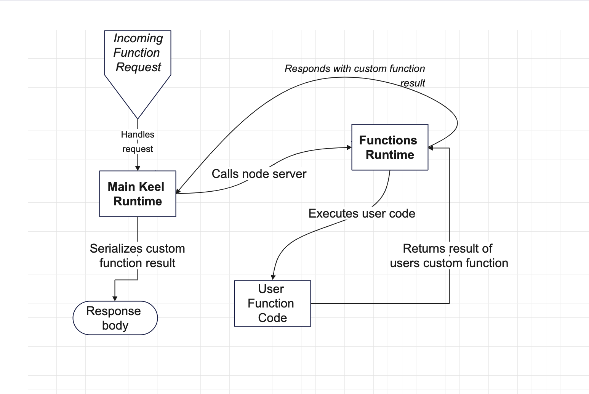

# Custom Functions

## A primer for the uninitiated 

A `.keel` schema file has two types of actions: `operations` which are endpoints that are automatically generated and handled by the Keel runtime, and `functions` which are custom endpints written by the end user in JavaScript / TypeScript.

A sample `.keel` schema that includes both of these concepts might look like:

```
model Post {
  operations {
    get getPost(id)
  }

  functions {
    get getPostCustom(id)
  }
}
```

The `getPostCustom` action above is a function, so therefore there must be a corresponding function file located at `functions/getPostCustom.ts`. The contents of that file might look like:

```ts
import { GetPostCustom } from "@teamkeel/sdk";

export default GetPostCustom((inputs, api) => {
  // do some other work

  return api.models.post.findOne(inputs);
});
```

The contents of the `@teamkeel/sdk` package are generated dynamically based on a `.keel` schema.

In the example above, the return value from the custom function is the result of a call to our database API, which in turn would be serialized in the response from the endpoint.

There are two 'entry points' for custom functions - via the `keel run` cmd, and via the `keel test` cmd - the implementation differs subtly between the two.

## Engineering guide

Custom functions are simply code that the end user has written to create a custom implementation of an action - but how do we take the code the user has written and serve it as part of our main runtime?

The Keel runtime has a [request handler](https://github.com/teamkeel/keel/blame/4b77cb6b73fab3d14e51d7d4473283f5ab4d7470/runtime/runtime.go#L32-L32) that creates a set of routes for all of the predefined API types (graphQL, JSON, JSONRPC) for every _action_ defined in a `.keel` schema file. This only applies to actions that are exposed via an `api` block:

```
model Post {
  fields {
    title Text
  }

  operations {
    create createPost() with(title)
  }

  functions {
    create createSpecialPost() with(title)
  }
}

model Author {
  fields {
    name Text
  }

  operations {
    // this wouldn't be exposed because it doesn't appear in the 'models' block in the api definition below
    create createAuthor() with(name) 
  }
}

api Web {
  models {
    Post
  }
}
```

For the example above, the routes that will be generated will produce a route dictionary that looks something like the below:

```
  /json/web [JSON API]
    CREATE createPost
    CREATE createSpecialPost
  /graphql/web [GraphQL API]
    MUTATION createPost
    MUTATION createSpecialPost
  /rpc/web [JSONRPC API]
    CREATE createPost
    CREATE createSpecialPost
  /json/openapi.json [OpenAPI definition]
```

Each API type has it's own handler implementation, but fundamentally they all share the same concept of taking an incoming request, containing a method or a path indicating what `action` is being requested (e.g `createPost` or `createSpecialPost` above), and additionally a payload to be passed to the action, and the job of each specific handler implementation is to decide whether the action call needs to be routed to the main Keel runtime, or if it is a custom functions request, and therefore needs to be handled by the Custom Functions runtime.

## The Custom Function runtime


*Diagram outlining basic flow for custom functions runtime request*

As previously mentioned, we have two runtimes - the primary Keel runtime which is written in Go (and eventually built into a binary executable file when it is published) that allows our end users to interact with dynamically generated endpoints based off of their schemas, and the custom functions runtime, which allows them to write JavaScript / TypeScript code, and for that to be executed when a request for a given custom function is made to the main Runtime.

The Custom Function runtime is a Node.js process that is spawned by the primary Keel runtime when you run the following Keel commands:

- `keel run -d ./my_keel_app`
- `keel test -d ./my_keel_app`

### Code generation

The Custom functions runtime is a small wrapper around the users custom functions that enables the serving of that code over HTTP. Many TypeScript + JavaScript files are code generated by our Keel CLI (Golang) based off of the contents of a `.keel schema`.

The codegen is primarily concerned with:

- Generating TypeScript definition files (`d.ts`) that describe the types defined in our Keel schema, namely:
  - `model` block defintiions and their `fields`
  - `enums`
- Generating strongly typed code that enables the user to interact with the database with good inference about the models - this includes the ability to write database queries that give a great signal about the model you are currently querying against, and its fields. 

Let's examine the anatomy of a fully formed Keel app that has some custom functions, and where codegen has taken place.:

- `.build/` **[GENERATED]**
  - `server.js` - entry point file that creates a HTTP server that listens for incoming requests from the Keel CLI. The Keel CLI spawns a node process that executes this file using `ts-node` (which allows for compilation of TypeScript code as well as JavaScript execution)
  - `vitest.config.mjs` - setup file to allow for custom matchers to be added to `keel test`.
  - `vitest.setup.mjs` - ditto 
- `functions/`
  - `createPost.ts` - user defined function
  - `createSpecialPost.ts` - user defined function
- `node_modules/@teamkeel/`
  - `sdk` **[GENERATED]** - dynamically generated NPM package that doesn't exist on the NPM registry - instead we generate the contents of this directory when the `run` or `test` cmds are executed, or when the contents of a `.keel` schema are changed.
  - `testing` **[GENERATED]** - dynamically generated NPM package that doesn't exist on the NPM registry - instead we generate the contents of this directory when the `run` or `test` cmds are executed, or when the contents of a `.keel` schema are changed.
  - `functions-runtime` - published NPM package containing static code that is referenced by the dynamically generated NPM packages above - contains useful code like the functions runtime Database API class as well as ancillary code to support the functions runtime
  - `testing-runtime` - published NPM package containing static code to support the `@teamkeel/testing` package.